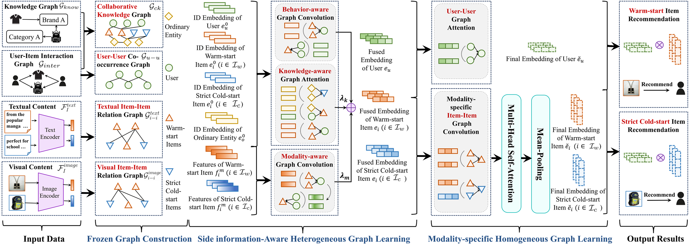

## **Firzen: Firing Strict Cold-start Items with Heterogeneous and Homogeneous Graphs for Recommendation**

This is the source code of our ICDE 2024 paper "[Firzen: Firing Strict Cold-start Items with Heterogeneous and Homogeneous Graphs for Recommendation](http://39.108.48.32/mipl/download_paper.php?fileId=202319)".



#### **Installation**
```python
conda create -n Firzen python=3.8 anaconda
conda activate Firzen
# Please install PyTorch according to your CUDA version.
conda install pytorch==1.13.0 pytorch-cuda=11.7 -c pytorch -c nvidia
pip install -r requirements.txt
```
#### **Data Preparation**

Our model is evaluated on *Amazon Beauty*, *Amazon Cell Phones and Accessories*, and *Amazon Clothing Shoes and Jewelry* datasets. You can download our processed datasets and unzip it to './data' folder:
- [Baidu Yun Pan](https://pan.baidu.com/s/1sjoatsrC0Dgs9kiRAafxhg): 1207

#### **Quick Start**

```python
# Amazon_Beauty
python run_itemcoldstart.py --dataset=Amazon_Beauty --model=Firzen --config_files=configs/knowledge_rec_beauty.yaml

# Amazon_Cell_Phones_and_Accessories
python run_itemcoldstart.py --dataset=Amazon_Cell_Phones_and_Accessories --model=Firzen --config_files=configs/knowledge_rec_cell_phones.yaml

# Amazon_Clothing_Shoes_and_Jewelry
python run_itemcoldstart.py --dataset=Amazon_Clothing_Shoes_and_Jewelry --model=Firzen --config_files=configs/knowledge_rec_clothing.yaml
```

#### **Acknowledgement**

Our code references the following projects. Many thanks to the authors.

- [Recbole](https://github.com/RUCAIBox/RecBole/tree/master/recbole)
- [MMRec](https://github.com/enoche/MMRec/tree/master)
- [MMSSL](https://github.com/HKUDS/MMSSL)
